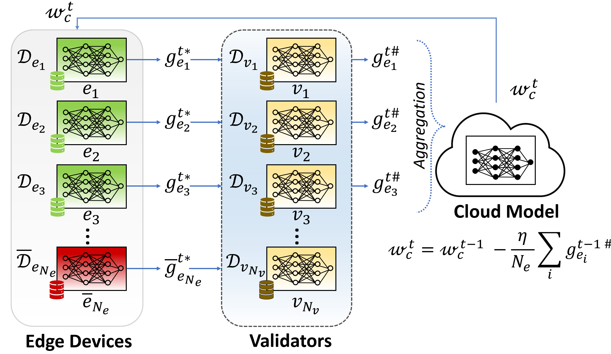
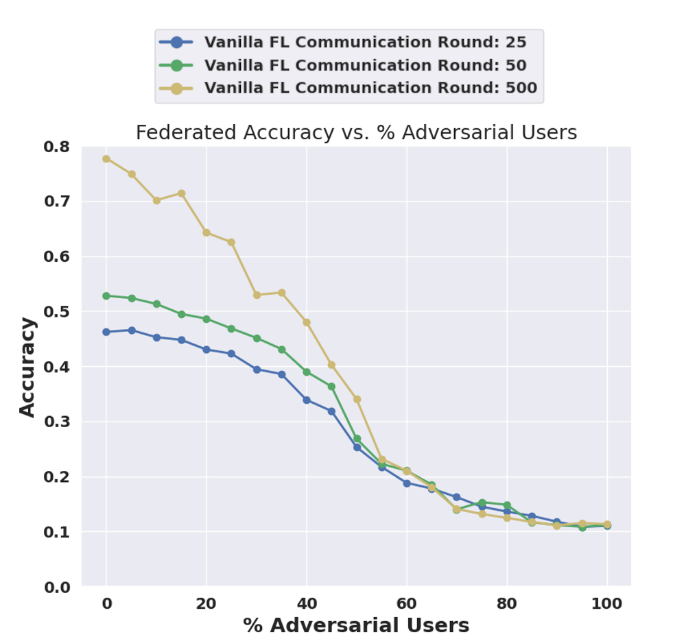
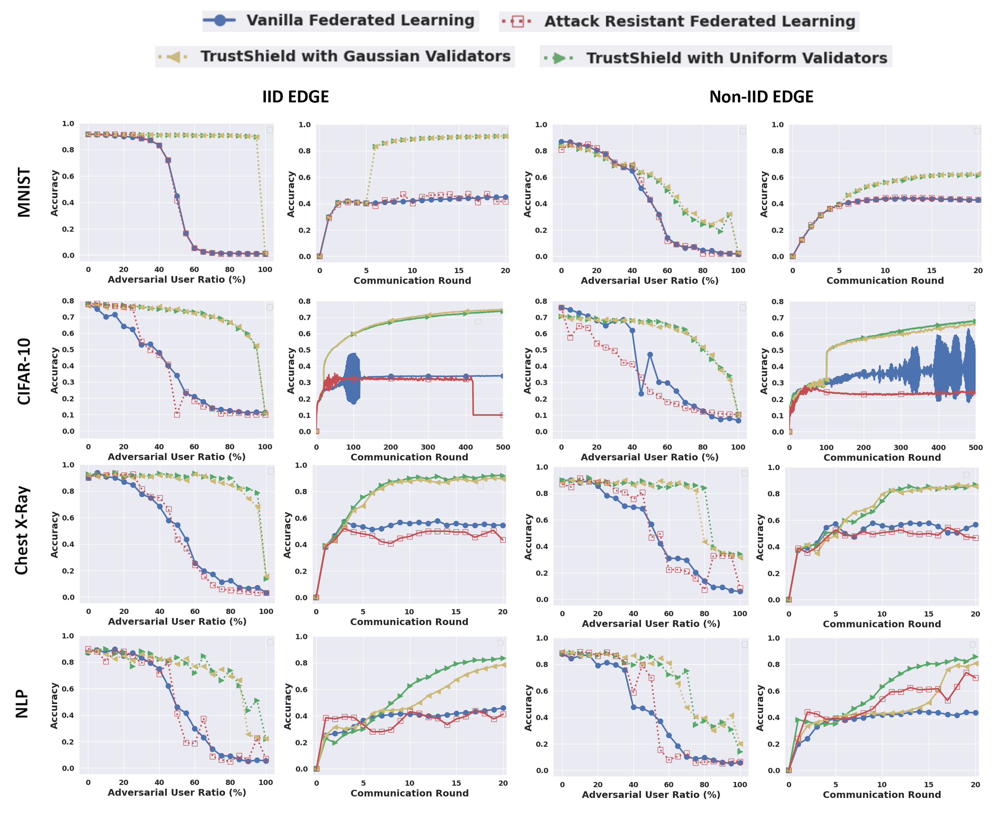
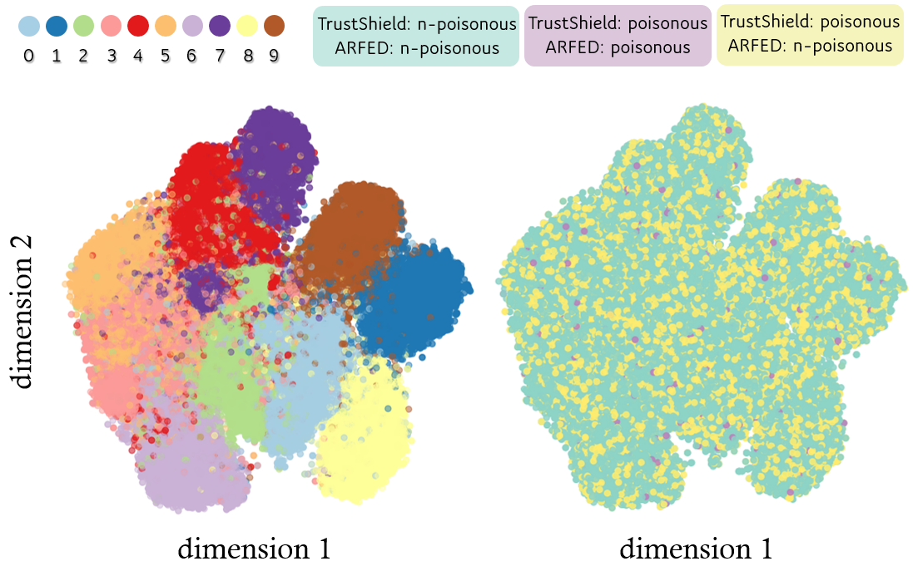
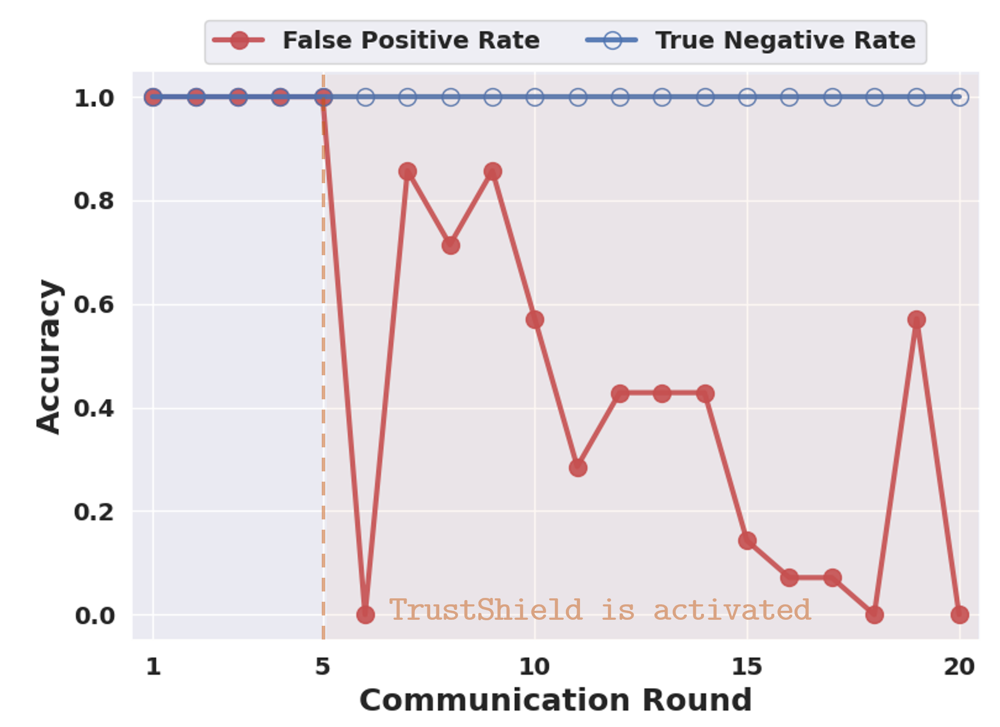
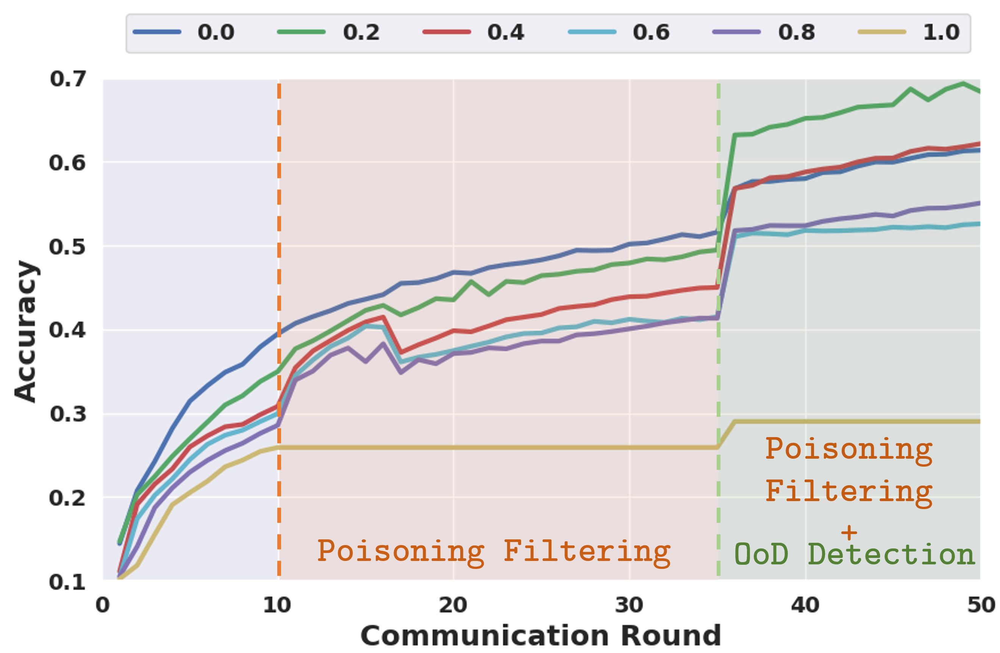
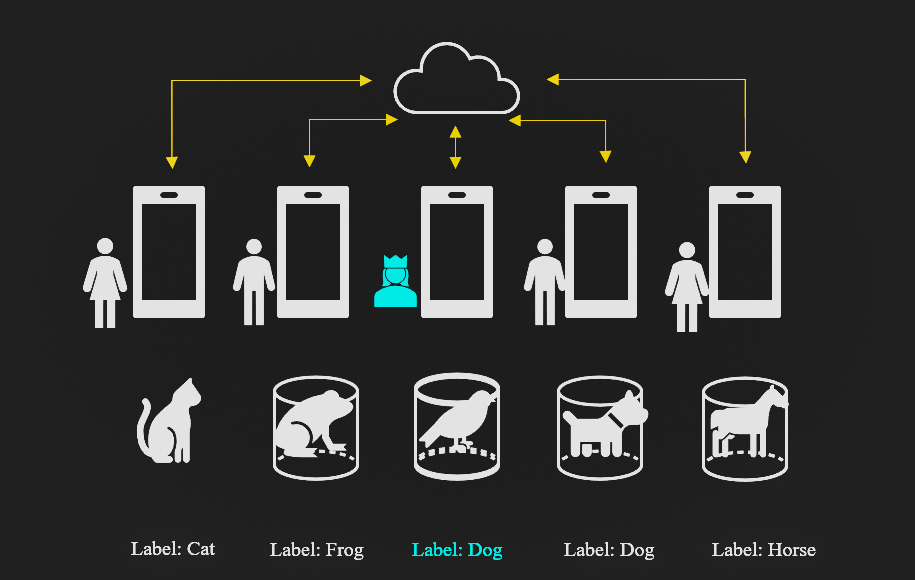
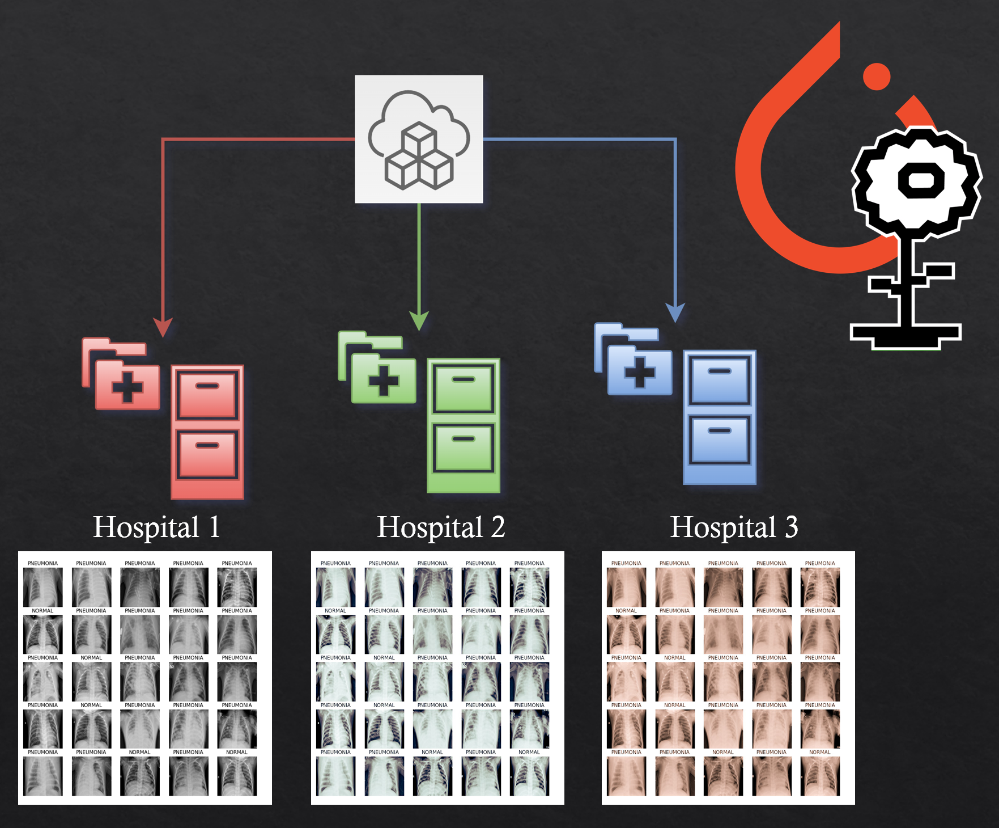

Welcome to the TrustShield repository! TrustShield is an innovative algorithmic solution designed to evaluate and mitigate Federated Learning (FL) Label Flipping (LF) attacks conducted by adversarial users in the system. This repository contains the implementation of TrustShield, an advanced algorithm that enhances the security of FL systems by introducing a layer of validators operating on a blockchain infrastructure. These validators evaluate edge updates, ensuring non-poisonous gradients for clean aggregation. This robust framework mitigates label-flipping attacks, enabling secure training processes within FL systems, even in complex settings where edge devices have independent and non-identically distributed datasets.

Link to paper: Will be inserted after acceptance.

## Table of Contents
- [TLDR](#TLDR)
- [Installation](#installation)
  - [Packages](#packages)
  - [Datasets](#dataset)
- [File Structure](#file-structure)
- [Usage](#usage)
- [Results](#results)

## TLDR
🚀 Welcome to TrustShield: Fortify Your Federated Learning!

TrustShield is your shield against adversarial storms in the world of Federated Learning. This open-source powerhouse introduces a cutting-edge defense mechanism against Label Flipping (LF) attacks. By harnessing the power of blockchain-backed validators, TrustShield ensures that your FL models remain unscathed and resilient, even in the face of malicious users. Say goodbye to vulnerabilities; TrustShield guarantees secure and robust FL training processes.

### 🛡 Why TrustShield?

#### Robust Security:
TrustShield empowers FL systems with a decentralized network of validators, certifying non-poisonous gradients for clean aggregation.
Advanced Defense: Battle-tested against LF attacks, TrustShield outshines vanilla FL and even surpasses state-of-the-art mechanisms.
Real-World Impact: Boost your medical ML projects and NLP applications with TrustShield’s resilience, ensuring privacy without compromising performance.

### 🌟 Key Features:
#### Trustworthy Validation:
Validators on a blockchain infrastructure ensure non-poisonous gradients, fortifying your FL models.
#### Performance Boost:
Witness significant accuracy improvements across datasets and communication rounds, even in challenging scenarios.
#### Efficient Detection:
TrustShield's OoD detection functionality enhances model performance, steering your FL systems to greater accuracy.

🚀 TrustShield: Where Security Meets Innovation. Let’s Shield FL Together!

Explore TrustShield now and elevate your Federated Learning projects to unprecedented heights. Secure, robust, and innovative—TrustShield is not just a solution; it’s a movement. Join us in shaping the future of FL security! 🛡✨

## Abstract
Federated Learning (FL) is widely embraced by today's distributed learning applications due to its privacy-preserving nature. However, as we have analyzed in this paper, privacy comes at the cost of security. FL is highly susceptible to label-flipping attacks due to the cloud's lack of access to private data on edge nodes, such as mobile phones. Hence, we have open-sourced TrustShield to enhance the security of FL systems through a layer of validators that evaluate the edge updates. These validators operate on a blockchain infrastructure, tracking the node evaluations. This framework mitigates label-flipping attacks and enables secure training process within FL systems, regardless of the difficulty of the setting, such as whether edge devices have independent and identically distributed (IID) datasets or not. We show the effectiveness of TrustShield by conducting experiments on four datasets: MNIST, CIFAR-10, Chest X-Ray, and a Natural Language Processing dataset. In IID settings, our algorithm improves performance by 52%, 40%, 38%, and 35% across the respective datasets. In the Non-IID settings, we observe improvements of 21%, 56%, 26%, and 39%, respectively. These improvements are compared to state-of-the-art benchmarks and are achieved when half of the nodes are adversarial.


## FL Scheme and The System Architecture:



After obtaining the weights $w_c^t$ for round $t$ from the cloud, edge node $e_i$ (green) trains a model using its private dataset $D_{e_i}$ and generates optimal gradients $g_{e_i}^{t*}$. Optimal gradients of all nodes are aggregated to update the cloud's model for the next round $w_c^{t+1}$. However, malicious node (red) might perform label flipping to form an adversarial dataset. Then, it can calculate a poisonous gradient over the malicious dataset. Sending for aggregation can perturb the performance of the cloud model. We propose using a layer of validators, called TrustShield (blue region), to certify non-poisonous gradients $g_{e_i}^{t}$ for clean aggregation by validator $v_j$ (yellow) performing inference over its private dataset $D_{v_j}$.

## Installation

### Installing TrustShield Package
To install the TrustShield as a github project:
```bash
git clone https://github.com/INFOCOM2024-TrustShield/TrustShield
```

### Required Packages
To run the necessary packages, build a conda environment from the [environment.yml]([environment.yml]) file as in:
```bash
conda env create -f environment.yml
```
NLP tasks require specific versions of these libraries that might conflict with the environment created for other tasks. One can create an environment from scratch for the NLP task with the code below.
```bash
pip install -r fl_nlp_implementation/requirements.txt
```

### Dataset

#### MNIST Dataset
MNIST (Modified National Institute of Standards and Technology) is a widely-used dataset in the field of machine learning. It consists of 70,000 grayscale images of handwritten digits (0-9), each being 28x28 pixels in size. This dataset is commonly used for training and testing image classification algorithms, serving as a fundamental resource for researchers and developers in the field. 
[MNIST](http://yann.lecun.com/exdb/mnist/)

#### CIFAR-10 Dataset
CIFAR-10 is a popular image dataset containing 60,000 32x32 color images, categorized into ten classes. These classes encompass common objects like animals, vehicles, and everyday items. It serves as a benchmark dataset for evaluating image classification algorithms in the fields of computer vision and deep learning.
[CIFAR-10](https://www.cs.toronto.edu/~kriz/cifar.html)

#### Chest X-Ray Dataset
This is a real-world medical dataset known as Chest X-Ray. This [Kaggle](https://www.kaggle.com/datasets/prashant268/chest-xray-covid19-pneumonia) dataset contains X-Ray images captured from patients with various conditions, including COVID, pneumonia, and normal cases. FL is particularly significant in the medical domain as it enables the utilization of sensitive and private medical data while ensuring data privacy and security.

#### eCommerce Dataset
This is an openly available dataset found on [Kaggle](https://www.kaggle.com/datasets/saurabhshahane/ecommerce-text-classification). It a sample dataset chosen for text classification, it contains over 27,000 unique samples of a short description of a product, labelled by its product category amongst Books, Clothing & Accessories, Fashion and Electronics.


## File-Structure
<details>
<summary>Click to Expand</summary>
fl_CIFAR_implementation/data - This is the dataset location for CIFAR-10 dataset.
fl_CIFAR_implementation/arfed_cifar10.py - This is the main file to run ARFED against LF attacks with a given adversarial user ratio as described in the [Attack Resistant Federated Learning](https://github.com/eceisik/ARFED).
fl_CIFAR_implementation/sims_cifar10.py - This is the main file used to run the FL for CIFAR10 with/without TrustShield with a given validator (Gaussian/Uniform) & edge data (IID/Non-IID) class distributions.
fl_CIFAR_implementation/fl_utils/ARFED_utils.py - This contains the module to induce protection against poisoning attacks as described in the [Attack Resistant Federated Learning](https://github.com/eceisik/ARFED) paper.
fl_CIFAR_implementation/fl_utils/construct_models.py - This contains the base classes that implement the DNN models.
fl_CIFAR_implementation/fl_utils/distribute_data.py - This contains primitives used to govern the data distribution of edge clients / validators in our FL system, as well as primitives to induce label flipping.
fl_CIFAR_implementation/fl_utils/plotting_utils.py - This contains the functions used for the figure plotting.
fl_CIFAR_implementation/fl_utils/textfile_utils.py - This contains the functions to adjust the text fonts and types in the figures.
fl_CIFAR_implementation/fl_utils/train_nodes.py - This contains the primitives to train and test the FL models (both edge and cloud).
fl_MNIST_implementation/data - This is the dataset location for MNIST dataset.
fl_MNIST_implementation/arfed_mnist.py - This is the main file to run ARFED against LF attacks with a given adversarial user ratio as described in the [Attack Resistant Federated Learning](https://github.com/eceisik/ARFED).
fl_MNIST_implementation/sims_mnist.py - This is the main file used to run the FL for MNIST with/without TrustShield with a given validator (Gaussian/Uniform) & edge data (IID/Non-IID) class distributions.
fl_MNIST_implementation/fl_utils/ARFED_utils.py - This contains the module to induce protection against poisoning attacks as described in the [Attack Resistant Federated Learning](https://github.com/eceisik/ARFED) paper
fl_MNIST_implementation/fl_utils/construct_models.py - This contains the base classes that implement the DNN models.
fl_MNIST_implementation/fl_utils/distribute_data.py - This contains primitives used to govern the data distribution of edge clients / validators in our FL system, as well as primitives to induce label flipping.
fl_MNIST_implementation/fl_utils/plotting_utils.py - This contains the functions used for the figure plotting.
fl_MNIST_implementation/fl_utils/textfile_utils.py - This contains the functions to adjust the text fonts and types in the figures.
fl_MNIST_implementation/fl_utils/train_nodes.py - This contains the primitives to train and test the FL models (both edge and cloud).
fl_medical_implementation/data - This is the location for Chest X-Ray dataset to be downloaded.
fl_medical_implementation/sims_med.py - This is the main file used to run the FL for Chest X-Ray with/without TrustShield with a given validator (Gaussian/Uniform) & edge data (IID/Non-IID) class distributions.
fl_medical_implementation/sims_med_ARFED.py - This is the main file to run ARFED against LF attacks with a given adversarial user ratio as described in the [Attack Resistant Federated Learning](https://github.com/eceisik/ARFED).
fl_medical_implementation/fl_utils/ARFED_utils.py - This contains the module to induce protection against poisoning attacks as described in the [Attack Resistant Federated Learning](https://github.com/eceisik/ARFED) 
fl_medical_implementation/fl_utils/construct_models.py - This contains the base classes that implement the DNN models.
fl_medical_implementation/fl_utils/distribute_data.py - This contains primitives used to govern the data distribution of edge clients / validators in our FL system, as well as primitives to induce label flipping.
fl_medical_implementation/fl_utils/plotting_utils.py - This contains the functions used for the figure plotting.
fl_medical_implementation/fl_utils/textfile_utils.py - This contains the functions to adjust the text fonts and types in the figures.
fl_medical_implementation/fl_utils/train_nodes.py - This contains the primitives to train and test the FL models (both edge and cloud).
fl_nlp_implementation/adv_utils/ARFED_utils.py - This contains the module to induce protection against poisoning attacks as described in the [Attack Resistant Federated Learning](https://github.com/eceisik/ARFED) paper.
fl_nlp_implementation/adv_utils/construct_models.py - This contains the base classes that implement the BERT models from Huggingface transformers.
fl_nlp_implementation/adv_utils/dataloader.py - This contains the base classes to load data for both the classification and question answering tasks.
fl_nlp_implementation/adv_utils/distribute_data.py - This contains primitives used to govern the data distribution of edge clients / validators in our FL system (for text classification), as well as primitives to induce label flipping.
fl_nlp_implementation/adv_utils/train_nodes.py - This contains the primitives to train and test the FL models (both edge and cloud).
fl_nlp_implementation/sims_adversarial.py - This is the main file used to run the FL system for the Text Classification task.
fl_nlp_implementation/ARFED_sims.py - This is the main file to run ARFED against LF attacks with a given adversarial user ratio as described in the [Attack Resistant Federated Learning](https://github.com/eceisik/ARFED).
</details>

## Usage

### Training an MNIST Classification Model for Classification
Run the following snippet to simulate FL on NLP test classification task - with / without poisoning attacks and with / without validation.
```
python3 fl_CIFAR_implementation/sims_mnist.py --deviceno <> --numusers <> --isnoniid <> --advratio <> --nrounds <> --trainamount <> --testamount <> --nepoch <> --batchsize <> --applymining <> --numvals <> --valdist <> --valn <>
```

### Training a CIFAR-10 Classification Model for Classification
Run the following snippet to simulate FL on NLP test classification task - with / without poisoning attacks and with / without validation.
```
python3 fl_CIFAR_implementation/sims_cifar10.py --deviceno <> --numusers <> --isnoniid <> --advratio <> --nrounds <> --trainamount <> --testamount <> --nepoch <> --batchsize <> --applymining <> --numvals <> --valdist <> --valn <>
```

### Training a Chest X-Ray Classification Model for Classification
Run the following snippet to simulate FL on NLP test classification task - with / without poisoning attacks and with / without validation.
```
python3 fl_medical_implementation/sims_med.py --deviceno <> --numusers <> --isnoniid <> --advratio <> --nrounds <> --trainamount <> --testamount <> --nepoch <> --batchsize <> --applymining <> --numvals <> --valdist <> --valn <>
```

### Training a BERT Model for Classification
Run the following snippet to simulate FL on NLP test classification task - with / without poisoning attacks and with / without validation.
```
python3 fl_nlp_implementation/sims_adversarial.py --test_num_classes <> --train_num_classes <> --trainamount <> --testamount <> --nepoch <> --nrounds <> --numusers <> --applymining <> --initround <> --valn <> --device <> --valdist <>
```

Run the following to understand the input arguments -
```
python3 fl_nlp_implementation/sims_adversarial.py --help
```

## Results
### Vulnerability of Vanilla FL to Poisoning Attacks

We conducted experiments to present  test accuracies of CIFAR-10 FL model training as the ratio of adversarial users increases in the system. Each curve represents a different round of FL communication. The results clearly indicate a significant degradation in performance as the malicious user activity intensifies, particularly in later rounds.  Remarkably, the shape of the curves for increasing adversarial users bears a striking resemblance to the inverse S-curve commonly observed in the susceptible trajectory in SIR pandemic modeling. The findings underscore the susceptibility of Vanilla FL to poisoning.

### TrustShield outperforms the benchmark Vanilla FL and provides a higher level of robustness compared to the state-of-the-art mechanism ARFED

Each row represents the results for 4 different datasets.
Column 1: When edge devices have IID class distributions TrustShield, effectively mitigates the LF attack, reducing its effect to almost zero. In contrast, ARFED fails to counteract high adversarial user ratios and exhibits a performance similar to Vanilla FL.
Column 2: TrustShield, demonstrates high accuracy improvements in any communication round compared to the baseline when half of the participants are adversarial. This holds true regardless of the class distribution of the validator nodes.
Column 3: Training an FL model with edge devices having Non-IID class distributions is challenging. However, TrustShield demonstrates significantly better performance for high adversarial user ratios in the system compared to other methods. 
Column 4: When edge devices have sparse datasets, the FL training with TrustShield, is more stable compared to other methods. TrustShield effectively mitigates the impact of adversarial users regardless of the validator class distributions, leading to a more stable and robust FL training process.

### Sample level performance of the defense mechanisms

We analyzed the CIFAR-10 dataset by creating a 2D t-SNE map from the CNN embedding to visualize different classes represented by distinct colors. Next, we examined the sample-level performance of defense mechanisms under a 30% adversarial user ratio. Green and purple points represent data samples correctly classified by both mechanisms, while yellow points indicate samples correctly classified only by our algorithm. The notable density of yellow points serves as compelling evidence of the superior efficiency of our algorithm compared to ARFED.

### The Detection Performance of the Algorithm per Round

We simulated an FL experiment using eCommerce NLP dataset with a 70% adversarial user ratio over 20 communication rounds. Our algorithm was activated during the 5th round. The plot illustrates the ratio of undetected malicious edge nodes in red and the ratio of detected collaborative edge nodes in blue. Evidently, the activation of our algorithm effectively reduces the ratio of adversarial nodes used in aggregation among all adversarial nodes. Simultaneously, it maintains a consistent 100\% ratio for collaborative nodes used in aggregation among all collaborative nodes throughout each 

### OoD Detection Functionality of TrustShield

In our CIFAR-10 FL experiments, we simulated different ratios of adversarial users, each represented by different colors. The OoD ratio (proportion of unknown classes) was set at 30%. Activating TrustShield's Poisoning Filtering during the 10th communication round significantly improved model performance for adversarial user ratios higher than 0. At the 35th round, TrustShield's OoD detection further enhanced model performance for all adversarial user ratios by excluding an unknown class that caused confusion during training.

## Last Overview

Federated learning is getting more common in large-scale machine learning applications thanks to its network efficiency and increased protection of edge user privacy. While increasing the data security of edge users, the accessibility to users decreases. This is a well-known tradeoff in cybersecurity literature. When the accessibility to users decreases, the cloud's capability to distinguish ordinary users from malicious users. Thus, additional security measures should be studied for the federated setting against several possible attacks.



One of the well-known attacks in the machine learning literature is the label flipping attack. The main logic, as shown in the figure above, changing the label of the data intentionally during the training stage in order to force the model to converge to the non-optimal local minima. Generally, since federated learning consists of hundreds of nodes at the edge, it is really hard to poison the model catastrophically. On the other hand, if some ratio of the node tries to poison the model collectively, then not only the model is being poisoned but also the overall federated system including ordinary users also being poisoned catastrophically. In order to mitigate such a problem we propose a decentralized verification mechanism. 


The system that we provide is shown in the figure above. The ordinary edge users (shown as green circles) send their gradients (green triangles) to the cloud to be aggregated before initializing the next stage of the federated optimization. Some of the users are selected to be malicious (red circle). They perform label flipping before training the model on their data. Then they send the poisoned update (red triangle) to the cloud to be aggregated for a non-optimal model. In this project, we provide some validators having their private data to test the gradients coming from edge users. They perform inference on their data with these gradients to conclude some of the users are malicious. If they reach a consensus about a user being malicious, this user is dropped from the system. In this way, the robustness of the system against such attacks is ensured. 




It is well known that machine learning applications in the medical area suffer from bad performance originating from a lack of data due to privacy issues. One of the best use cases of federated learning is medical machine learning since it does not violate patient privacy while not giving up on ML performance. Thus, we will utilize medical datasets to synthetically realize real-world hospitals and implement our algorithm.
